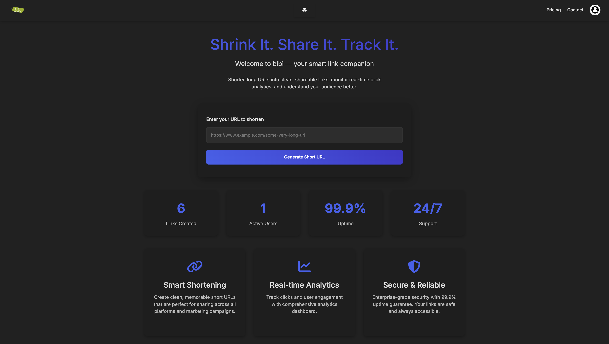
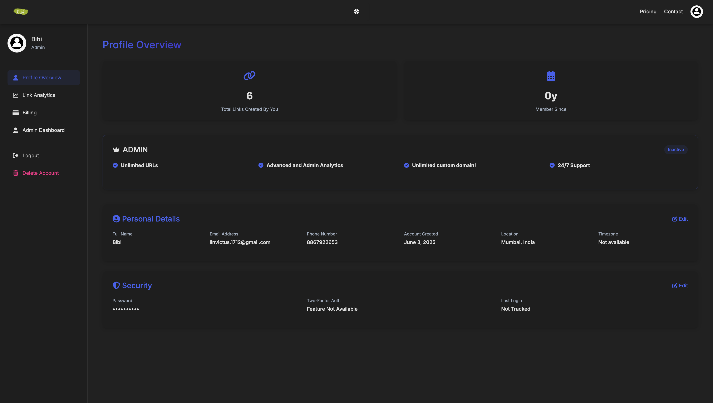
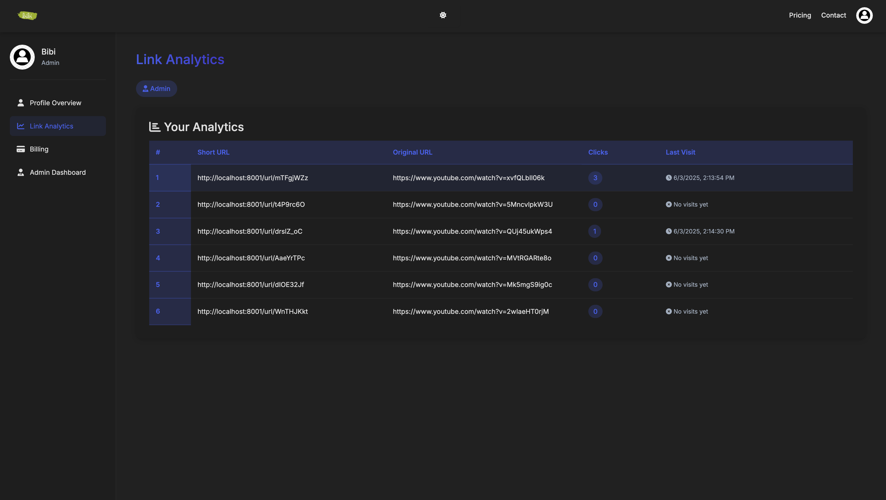
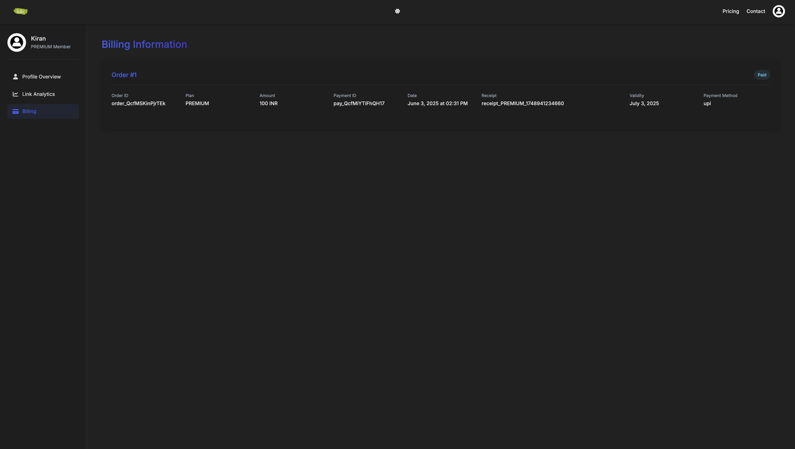
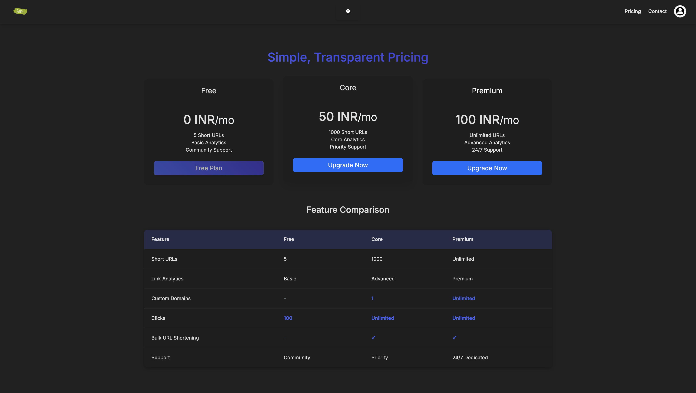
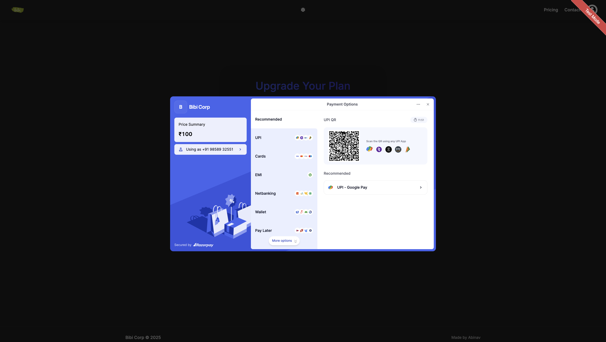
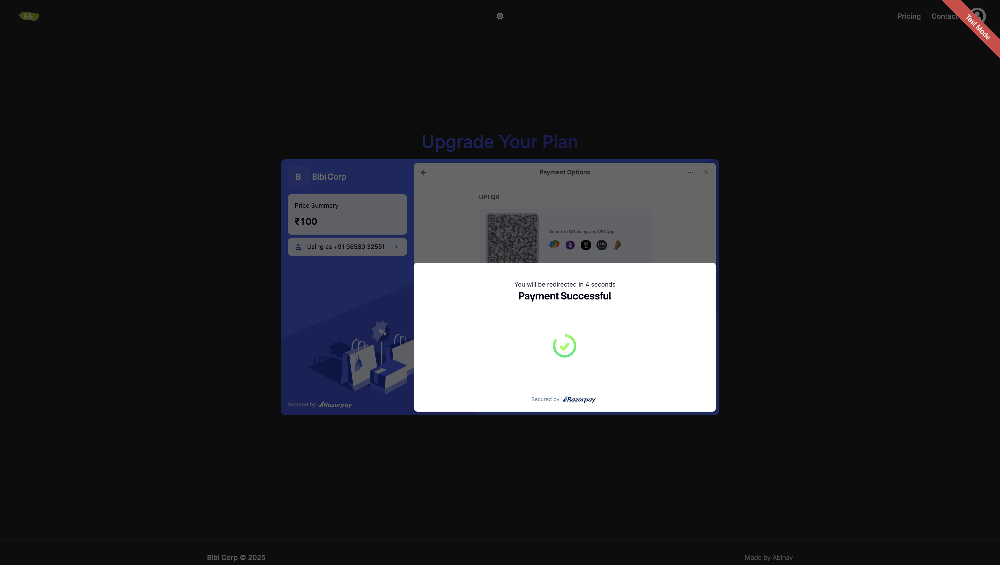
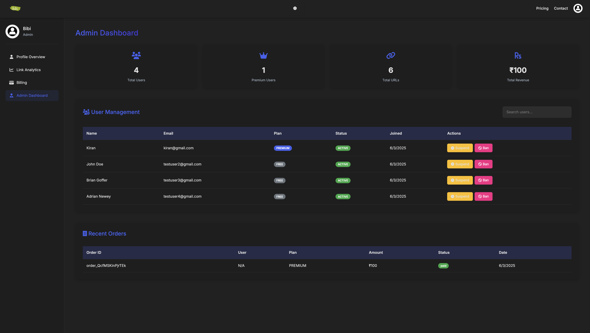

# URL Shortener

> A full-stack URL shortening service with analytics, user authentication, and payment integration.

<div align="center">




</div>

---

## Features

### **For Users**
- 🔗 **Shorten URLs** - Transform long URLs into compact, shareable links
- 📊 **Analytics Dashboard** - Track link clicks with detailed insights
- 🔐 **Authentication** - Secure signup and login system
- 💳 **Subscription Plans** - Free, Core & Premium tiers available
- 💰 **Payment Integration** - Seamless payments via Razorpay (Test mode)
- 📧 **Email Notifications** - Automated emails using Nodemailer

### **For Admin**
- 📋 **User Management** - Comprehensive dashboard to manage all users
- 🗂️ **Link Management** - View and delete shortened links
- 💸 **Transaction Monitoring** - Track all user transactions
- 🚫 **Account Control** - Suspend or delete user accounts
- 📈 **System Analytics** - Access platform-wide statistics

---

## Tech Stack

<table>
<tr>
<td>

### **Frontend**
-  **EJS**
-  **CSS** 
-  **JavaScript** 

</td>
<td>

### **Backend**
-  **Node.js** 
-  **Express.js** 
-  **MongoDB** 

</td>
</tr>
</table>

### **APIs & Services**
- 💳 **Razorpay API** - Payment processing
- 📧 **Nodemailer** - Email notifications  
- 🔑 **JWT** - Authentication tokens

---

## Screenshots
<h4> User Dashboard </h4>



<h4> Link Analytics </h4>



<h4> Billing </h4>



<h4> Pricing </h4>



<h4> Payment Gateway </h4>




<h4> Admin Dashboard </h4>




---

## Setup & Installation

### **Prerequisites**
- 
- 
- 🔑 Razorpay test API keys

### **Installation Steps**

#### 1️⃣ **Clone the repository**
```bash
git clone https://github.com/R-Abinav/url-shortener.git
cd url-shortener
```

#### 2️⃣ **Install dependencies**
```bash
npm install
```

#### 3️⃣ **Set up environment variables**
Create a `.env` file in the root directory:
```env
#PORT
PORT=your_desired_port_number

# Database
MONGO_URL=your_mongodb_connection_string

# Payment Gateway
RAZORPAY_TEST_KEY_ID=your_razorpay_test_key
RAZORPAY_TEST_KEY_SECRET=your_razorpay_test_secret

# Authentication
JWT_SECRET=your_jwt_secret_key

# Email Service
NODEMAILER_SENDER_EMAIL=your_nodemailer_email
NODEMAILER_SENDER_AUTH=your_email_app_password

# Server
BASE_URL=http://localhost:3000
```

#### 4️⃣ **Run the development server**
```bash
npm run dev
```

#### 5️⃣ **Access the application**
```text
🌐 Open http://localhost:PORT in your browser (Use any PORT)
```

---

## Project Structure

```
url-shortener/
├── controllers/       # Route controllers
├── middlewares/       # Custom middlewares
├── models/            # MongoDB models
├── public/            # Static assets or images
├── routes/            # Express routes
├── service/           # Authentication services
├── views/             # EJS templates           
├── index.js           # Main application file
├── .env               # Environment variables
└── package.json
```

---

## 🤝 Contributing

Contributions are welcome! Please follow these steps:

1. **🍴 Fork** the project
2. **🌿 Create** your feature branch 
   ```bash
   git checkout -b feature/AmazingFeature
   ```
3. **💾 Commit** your changes 
   ```bash
   git commit -m 'Add some amazing feature'
   ```
4. **🚀 Push** to the branch 
   ```bash
   git push origin feature/AmazingFeature
   ```
5. **📝 Open** a Pull Request

---

## 📄 License

This project is licensed under the **MIT License**.

---

<div align="center">

### 🌟 **Star this repository if you found it helpful!**

Made with ❤️ by [Abinav](https://github.com/R-Abinav)

</div>